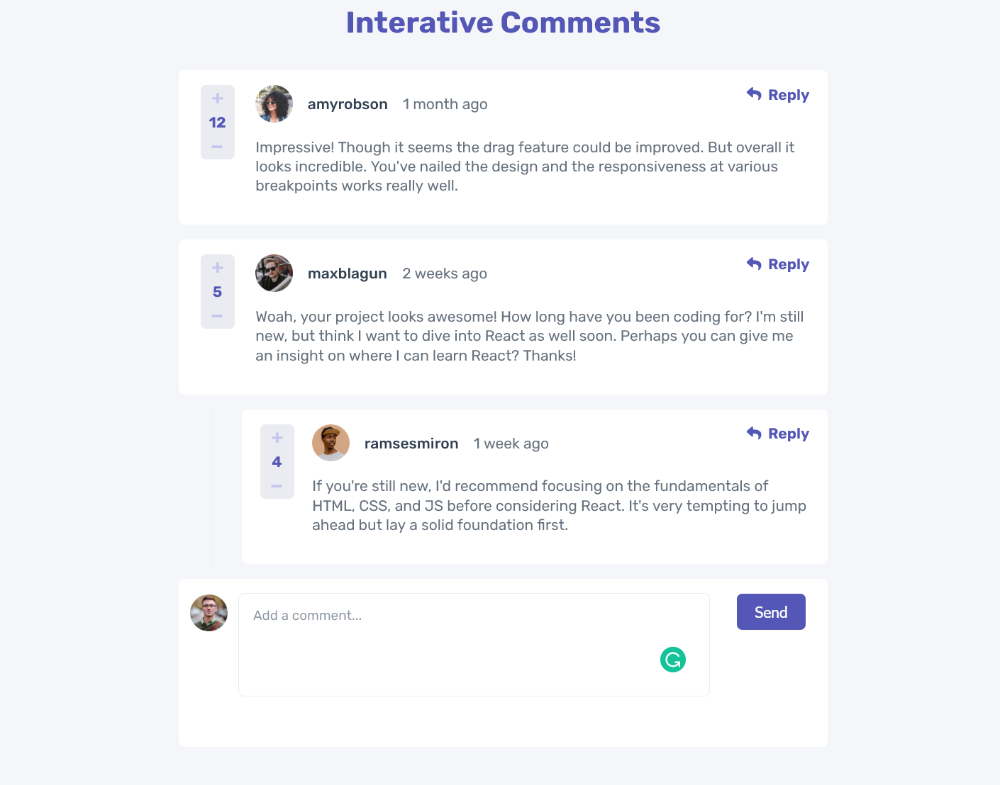
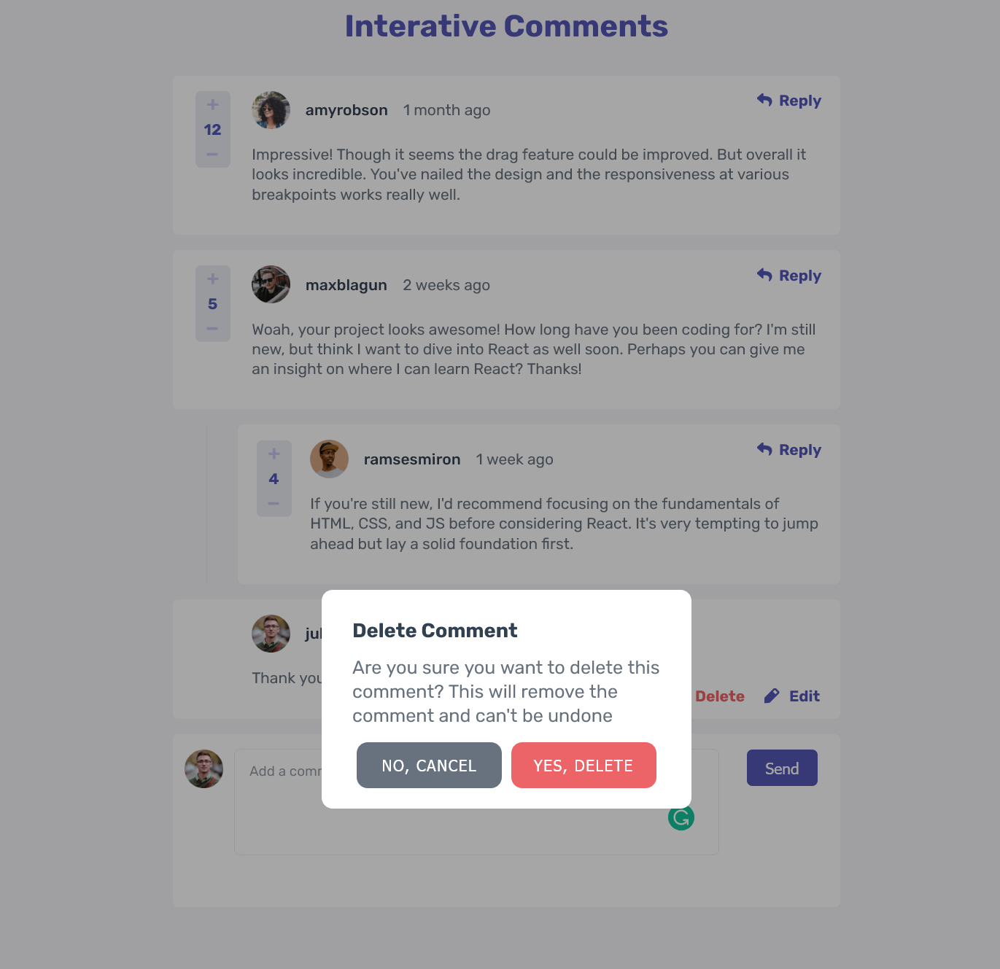

# Frontend Mentor - Interactive comments section solution

This is a solution to the [Interactive comments section challenge on Frontend Mentor](https://www.frontendmentor.io/challenges/interactive-comments-section-iG1RugEG9). Frontend Mentor challenges help you improve your coding skills by building realistic projects.

## Table of contents

- [Overview](#overview)
  - [The challenge](#the-challenge)
  - [Screenshot](#screenshot)
  - [Links](#links)
- [My process](#my-process)
  - [Built with](#built-with)
  - [What I learned](#what-i-learned)
  - [Continued development](#continued-development)
  - [Useful resources](#useful-resources)
- [Author](#author)
- [Acknowledgments](#acknowledgments)

**Note: Delete this note and update the table of contents based on what sections you keep.**

## Overview

### The challenge

Users should be able to:

- View the optimal layout for the app depending on their device's screen size
- See hover states for all interactive elements on the page
- Create, Read, Update, and Delete comments and replies
- Upvote and downvote comments
- **Bonus**: If you're building a purely front-end project, use `localStorage` to save the current state in the browser that persists when the browser is refreshed.
- **Bonus**: Instead of using the `createdAt` strings from the `data.json` file, try using timestamps and dynamically track the time since the comment or reply was posted.

### Screenshot

### Links

- Solution URL: [Github Repo](https://github.com/skoodath/comments-section)
- Live Site URL: [Interactive Comments](https://comments-interactive.netlify.app/)

## My process

### Built with

- ReactJS
- CSS-In-JS
- Flexbox
- Context API
- Mobile-first workflow
- [React](https://reactjs.org/) - JS library
- [Styled Components](https://styled-components.com/) - For styles

### What I learned

- Advanced use of Array methods map and filter along with ES6 features like array destructuring
- Deeper understanding of context API and useContext for state management
- Leveraged ES6 features like destructuring optimally

### Continued development

I need to add few more features like replying to a reply and also make this a fullstack app in the next iteration

## Author

- Frontend Mentor - [@skoodath](https://www.frontendmentor.io/profile/skoodath)
- LinkedIn - [@nambiars](https://www.linkedin.com/in/nambiars/)

## Acknowledgments

I want to give a shoutout to [@efethegenius](https://www.frontendmentor.io/profile/efethegenius) whose work on the same helped me visualize it real time and get an idea of flow.
